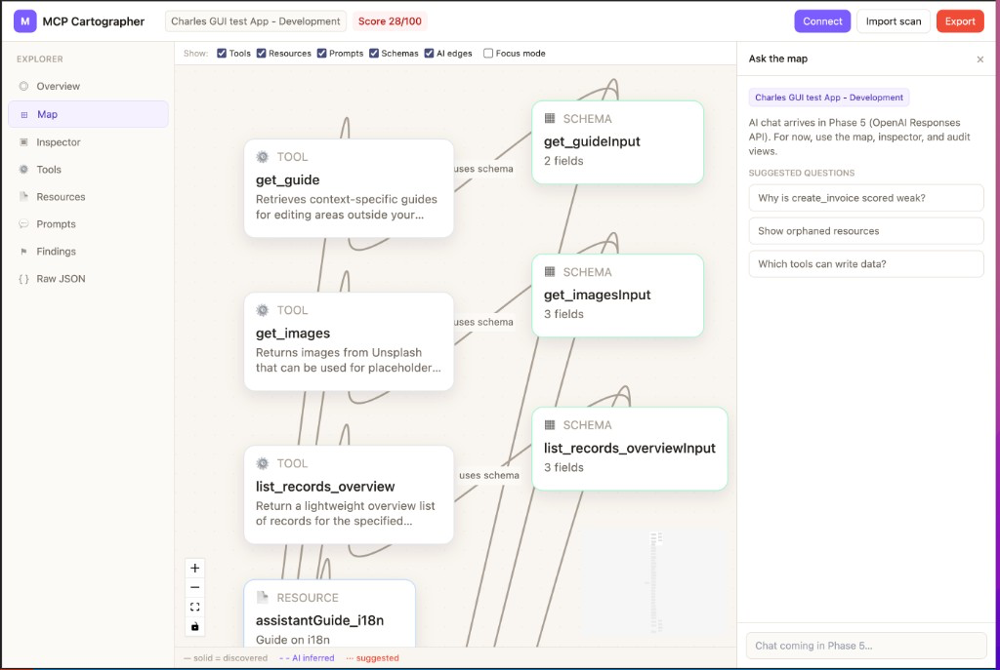

# MCP Cartographer

**Map, inspect, and audit Model Context Protocol (MCP) servers for AI-agent readiness.**

MCP Cartographer goes beyond a simple capability listing. It discovers tools, resources, and prompts from a live MCP endpoint, builds an interactive graph of how they relate, and scores how well an AI agent can actually *use* the server — surfacing weak descriptions, missing schemas, unclear side effects, and orphaned resources.



## Why MCP Cartographer?

Most MCP inspectors answer: *what does this server expose?*  
MCP Cartographer also answers: *can an agent use it well?*

| Capability | Description |
|------------|-------------|
| **Live discovery** | Connect to remote MCP servers (Streamable HTTP + SSE fallback) via a local API proxy |
| **Interactive map** | Vue Flow graph of tools, resources, prompts, and input schemas |
| **Readiness audit** | Deterministic findings with an overall score (0–100) |
| **Inspector** | Drill into any node — schemas, descriptions, metadata |
| **Export** | Download scan results as JSON or Markdown report |
| **Import** | Load saved `scan.json` files for offline review |

Credentials are sent only to your **local** API proxy and are never written to browser storage.

## Quick start

```bash
pnpm install

# Terminal 1 — API proxy (reads .env for dev MCP credentials)
pnpm dev:api

# Terminal 2 — Vue app
pnpm dev:web
```

Or run both together:

```bash
pnpm dev
```

Open [http://localhost:5173](http://localhost:5173), click **Connect**, then **Connect & Scan**.

For development against a Klai Studio MCP endpoint, copy `.env.example` to `.env` and fill in `MCP_DEV_*` values. Use **Load dev connection from .env** in the connect modal.

You can also click **Load sample** to explore the UI without a live server.

## What's included

### Phase 1 — Foundation
- Sample scan fixture and JSON import
- Vue Flow cartography map with pan/zoom
- Node inspector, audit findings panel, report export

### Phase 2 — Live remote MCP
- Fastify API proxy (`apps/api`, port 3333)
- `@modelcontextprotocol/sdk` client with Streamable HTTP + SSE fallback
- Connection modal with ephemeral headers
- `POST /api/mcp/test` and `POST /api/mcp/scan` endpoints

### Roadmap
- **Phase 3:** Inspector probe mode (call tools from the UI)
- **Phase 5:** OpenAI Responses API — "Ask the map" chat + deeper AI analysis
- **Phase 6:** Local HTTP MCP, import CLI, stdio bridge

## Monorepo layout

```
apps/web/              Vue 3 + Vite + Tailwind frontend
apps/api/              Fastify MCP proxy API
packages/shared/       Shared TypeScript types (ScanDocument, GraphNode, Finding, …)
packages/scan-core/    Scan normalization, graph builder, findings, export
packages/mcp-client/   MCP SDK connection + discovery wrapper
```

## Scoring (current)

Readiness scoring is **deterministic** today (no LLM required):

- Weak tool descriptions (&lt; 20 characters)
- Missing input JSON Schema on tools
- Unclear side effects (heuristic on tool name/description)
- Orphaned resources (no text match to any tool description)

Overall score starts at 100 and subtracts per finding severity. AI-powered dimension analysis arrives in Phase 5.

## Tech stack

- **Frontend:** Vue 3, Vite, Tailwind CSS, Vue Flow, Pinia, Dagre
- **API:** Fastify, `@modelcontextprotocol/sdk`
- **Monorepo:** pnpm workspaces, TypeScript

## License

See repository for license details.

Built by [Delfs' Engineering](https://github.com/DelfsEngineering).
